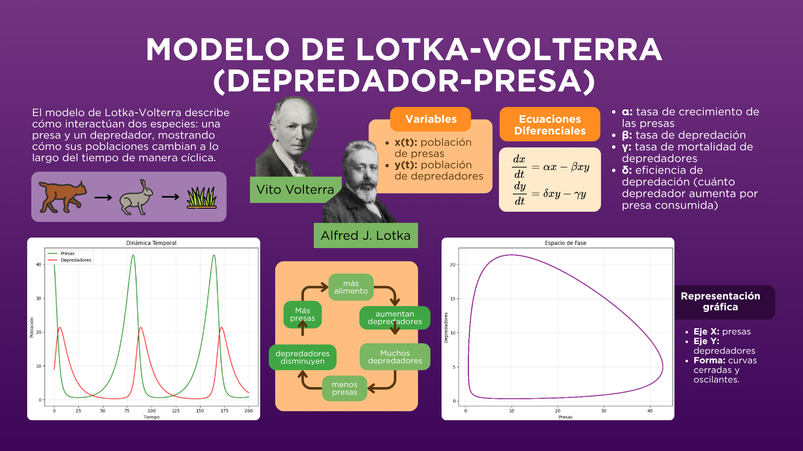
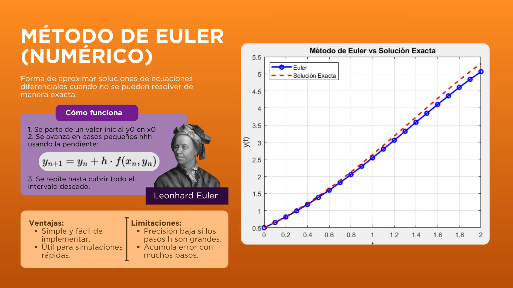
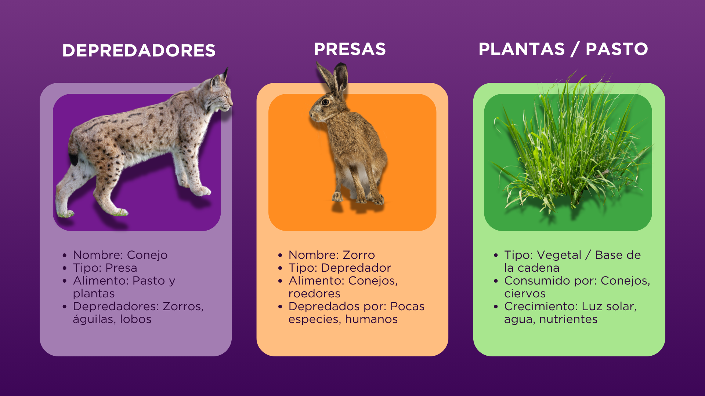
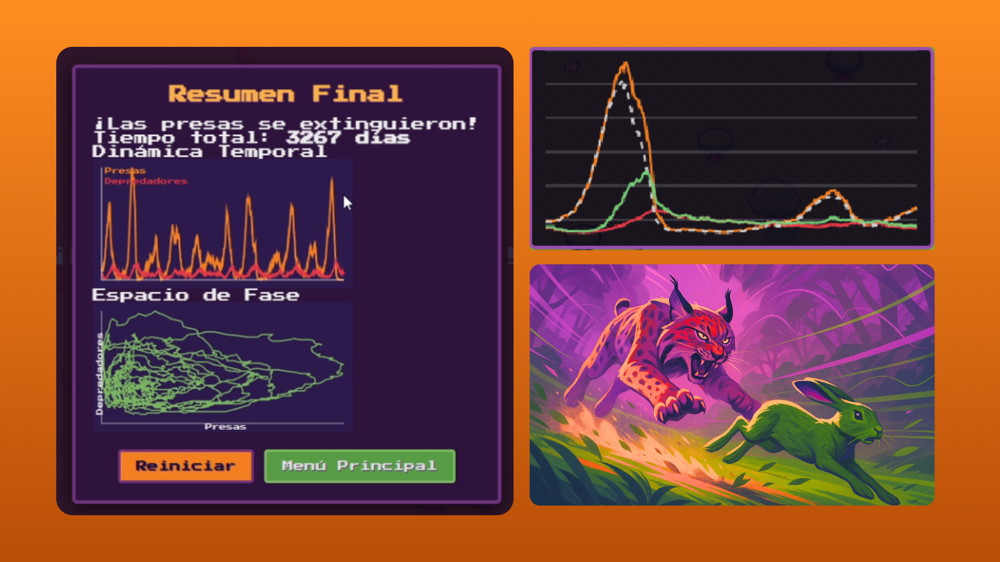
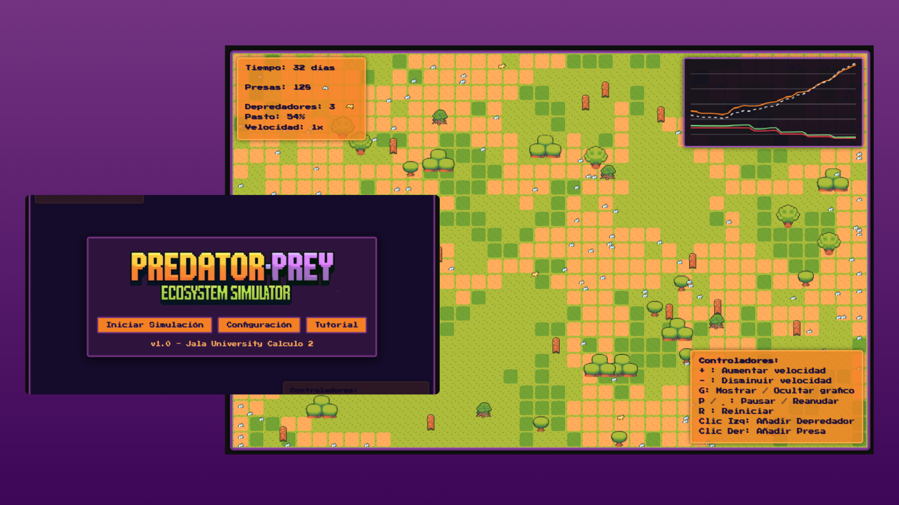

# Predator Prey Ecosystem Simulator 🐇🦊🌿

[](#)
[](#)
[](#)
[](#)


[](#)

# Simulador de Ecosistema Depredador‑Presa

## Descripción del Proyecto

El **Predator-Prey Ecosystem Simulator** es una aplicación web interactiva que modela la dinámica de un ecosistema simplificado compuesto por dos especies: presas (conejos) y depredadores (linces). El sistema está basado en el modelo matemático de Lotka-Volterra, ampliamente utilizado en ecología para estudiar las interacciones entre especies.

El objetivo principal del proyecto es proporcionar una herramienta didáctica que permita visualizar y comprender cómo evolucionan las poblaciones a lo largo del tiempo en función de diferentes parámetros, como tasas de crecimiento, depredación y mortalidad.

El simulador permite al usuario experimentar modificando estos parámetros en tiempo real, observando fenómenos como:

- Oscilaciones poblacionales
- Puntos de equilibrio
- Extinción de especies

Este proyecto está orientado a estudiantes y personas interesadas en áreas como matemática aplicada, ecología, simulación de sistemas dinámicos y programación.

---

## Características

- **Simulación en tiempo real** con actualización continua de la población y del entorno.
- **Ajuste de parámetros clave** del modelo de Lotka-Volterra (α, β, δ, γ) y condiciones iniciales (número de presas y depredadores).
- **Control de velocidad de simulación** para acelerar o ralentizar la evolución temporal.
- **Interacción directa con el ecosistema**:
    - Clic izquierdo → añade un depredador.
    - Clic derecho → añade una presa.
- **Pausa y reanudación** con teclas **P** o **Espacio**.
- **Visualización gráfica** de poblaciones actuales, pasto disponible y gráfico dinámico de evolución.
- **Resumen final** al producirse una extinción, con gráficos de dinámica temporal y espacio de fases.
- **Decoraciones estáticas** (árboles, troncos) que enriquecen la escena visual.
- **Efectos visuales** de aparición y muerte de individuos.
- **Interfaz amigable** con pantallas de inicio, configuración, tutorial y menú principal.

---

## Requisitos Previos

Para ejecutar el simulador solo necesitas un navegador web moderno (Chrome, Firefox, Edge, Safari). No requiere instalación de servidores ni dependencias externas más allá de los recursos gráficos que acompañan al proyecto.

- **Navegador web** compatible con HTML5, CSS3 y JavaScript.
- **Carpeta `assets/`** completa con todas las imágenes y sprites (debe estar presente en la misma ruta que los archivos HTML/JS).
- **Resolución recomendada**: 1280×800 píxeles (el canvas se adapta mediante transformaciones en pantallas más pequeñas).

---

## Instalación

Sigue estos pasos para ejecutar el proyecto en tu entorno local:

1. Clona el repositorio:
    
    ```
    git clone https://github.com/GutBla/PROJECT_Predator_Prey_Ecosystem_Simulator.git
    ```
    
2. Accede al directorio del proyecto:
    
    ```
    cd PROJECT_Predator_Prey_Ecosystem_Simulator
    ```
    
3. Abre el archivo principal:
    
    ```
    index.html
    ```
    
4. Ejecuta el proyecto:
- Haz doble clic en `index.html`o Ábrelo con tu navegador web (recomendado: Chrome o Edge)

---

## Uso

Al abrir la aplicación se muestra una pantalla de inicio con tres opciones:

- **Iniciar Simulación**: comienza la simulación con los parámetros actuales.
- **Configuración**: permite ajustar:
    - Cantidad inicial de presas y depredadores.
    - Velocidad de la simulación (1 a 10).
    - Coeficientes del modelo de Lotka‑Volterra:
        - **α**: tasa de crecimiento de las presas.
        - **β**: tasa de mortalidad de las presas por encuentro con depredadores.
        - **δ**: eficiencia con la que los depredadores convierten presas en energía.
        - **γ**: tasa de mortalidad natural de los depredadores.
- **Tutorial**: muestra un resumen de controles y funcionalidades.

### Controles durante la simulación

| Acción | Tecla / Interacción |
| --- | --- |
| Pausar / Reanudar | `P` o `Espacio` |
| Aumentar velocidad | `+` |
| Disminuir velocidad | `-` |
| Reiniciar simulación | `R` |
| Mostrar / Ocultar gráfico | `G` |
| Agregar depredador | Clic izquierdo en el canvas |
| Agregar presa | Clic derecho en el canvas |
| Regresar al menú principal | Desde pantalla de pausa o resumen |

Durante la ejecución, el panel izquierdo superior muestra el tiempo transcurrido (días), conteos actuales de presas, depredadores y porcentaje de pasto vivo, así como la velocidad actual. A la derecha aparece un gráfico en tiempo real que compara las poblaciones reales con las predichas por el modelo Lotka‑Volterra.

Si una especie se extingue, el simulador muestra un mensaje de advertencia y, tras un breve período, presenta una pantalla de resumen con dos gráficos:

- **Dinámica Temporal**: evolución de presas y depredadores en el tiempo.
- **Espacio de Fase**: trayectoria en el plano (presa vs. depredador).

Desde allí puedes reiniciar o volver al menú principal.

---

## Modelo de Lotka-Volterra



El comportamiento del sistema se basa en el modelo clásico de Lotka-Volterra, el cual describe la interacción entre dos poblaciones mediante un sistema de ecuaciones diferenciales no lineales de primer orden:

**Presa:**

$$
\frac{dP}{dt} = \alpha P - \beta P D
$$

**Depredador:**

$$
\frac{dD}{dt} = \delta P D - \gamma D
$$

Donde:

- $P(t)$ = número de presas (conejos/liebres)
- $D(t)$ = número de depredadores (linces)
- $\alpha$ = tasa de crecimiento natural de las presas en ausencia de depredadores
- $\beta$ = tasa de mortalidad de presas por encuentro con depredadores
- $\delta$ = eficiencia de conversión de presas en nuevos depredadores
- $\gamma$ = tasa de mortalidad natural de los depredadores

En este simulador, las ecuaciones se integran numéricamente en paralelo con la simulación basada en agentes para ofrecer una referencia teórica (representada como línea discontinua en la gráfica) y permitir al usuario comparar el comportamiento emergente real con el modelo idealizado.

## Análisis del sistema

El sistema presenta un punto de equilibrio no trivial, obtenido al igualar ambas ecuaciones a cero:

$$
P^* = \frac{\gamma}{\delta}, \qquad D^* = \frac{\alpha}{\beta}
$$

Alrededor de este punto, el sistema tiende a exhibir **órbitas cerradas**, lo que implica un comportamiento oscilatorio periódico de ambas poblaciones. Esto se puede visualizar directamente en el **espacio de fase** generado al finalizar la simulación.

Algunas propiedades importantes del sistema:

- El sistema es **no lineal**, debido al término de interacción $PD$.
- Existe una **dependencia mutua** entre especies: cada población afecta a la otra.
- Las soluciones **no tienen forma cerrada general**, por lo que se requiere aproximación numérica.
- Las oscilaciones presentan un **desfase temporal**: el máximo de depredadores ocurre después del máximo de presas.
- El sistema es **sensible a las condiciones iniciales**: pequeñas variaciones en los parámetros o poblaciones iniciales pueden alterar drásticamente la estabilidad.

## Método numérico (Euler)

Dado que el sistema no posee solución analítica general, se utiliza el **método de Euler** para aproximar las soluciones en tiempo discreto. La implementación en `simulation.js` aplica las siguientes iteraciones cada 10 ticks de simulación, con un paso de tiempo $\Delta t = 0.5$:

$$
P_{t+1} = P_t + (\alpha P_t - \beta P_t D_t)\,\Delta t
$$

$$
D_{t+1} = D_t + (\delta P_t D_t - \gamma D_t)\,\Delta t
$$

Ambos valores se restringen a $\geq 0$ para evitar poblaciones negativas. Los resultados acumulados se almacenan en el arreglo `lvData` y se grafican como **línea discontinua** superpuesta al comportamiento real de los agentes, permitiendo una comparación directa entre la teoría y la dinámica emergente.



## Simulación basada en agentes



Cada entidad del ecosistema (presa, depredador, pasto) opera de forma autónoma con las siguientes reglas:

**Pasto:**

- Crece con el tiempo y se degrada cuando es consumido por las presas.
- Afecta indirectamente a toda la cadena alimentaria al determinar la disponibilidad de alimento para las presas.

**Presas (conejos):**

- Se mueven con dirección aleatoria que cambia cada 60 pasos.
- Consumen energía al moverse y la recuperan al alimentarse del pasto.
- Se reproducen al superar un umbral de energía, generando una nueva presa cercana.
- Mueren cuando su energía llega a cero.

**Depredadores (linces):**

- Se mueven con dirección aleatoria que cambia cada 100 pasos.
- Pierden **0.8 unidades de energía** por tick de movimiento.
- Al cazar una presa, ganan **40 unidades de energía**.
- Se reproducen cuando su energía supera **150 unidades**, con un costo reproductivo de **60 unidades**.
- Mueren cuando su energía llega a cero.

Este enfoque permite visualizar fenómenos **emergentes** como la formación de agrupaciones, el efecto de la distribución espacial y la influencia de la heterogeneidad del entorno, que el modelo continuo de Lotka-Volterra no puede capturar.

## Visualización y análisis gráfico



El simulador genera tres representaciones gráficas diferenciadas:

1. **Gráfico en tiempo real** (durante la simulación): muestra las curvas de presas (naranja, línea sólida) y depredadores (rojo, línea sólida) junto con la predicción teórica de Lotka-Volterra (gris discontinuo para presas, verde discontinuo para depredadores).
2. **Dinámica temporal** (pantalla de resumen): grafica la evolución completa de ambas poblaciones a lo largo del tiempo total de simulación.
3. **Espacio de fase** (pantalla de resumen): representa la relación $D$ vs. $P$ para evidenciar las órbitas cíclicas propias del modelo Lotka-Volterra.

## Interpretación



La combinación de dos enfoques complementarios permite analizar el sistema desde dos perspectivas:

| Perspectiva | Modelo | Características |
| --- | --- | --- |
| **Teórica** | Ecuaciones diferenciales (Lotka-Volterra) | Comportamiento idealizado, continuo |
| **Computacional** | Simulación basada en agentes | Comportamiento emergente con interacción espacial y energía |

Esta dualidad facilita la comprensión de conceptos clave en cálculo y sistemas dinámicos:

- **Estabilidad** y puntos de equilibrio
- **Oscilaciones** periódicas y desfase entre especies
- **Sensibilidad a condiciones iniciales**
- **Extinción** como caso límite del sistema dinámico

---

## Ejecución del Proyecto

